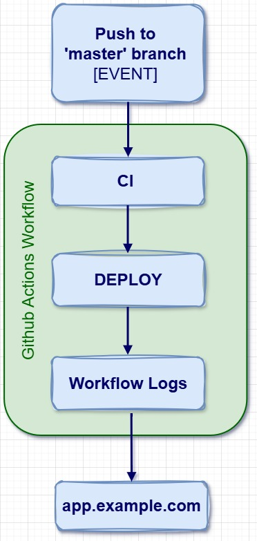

# Basic CI Workflow for Static HTML/CSS/JS Using GitHub Actions
This repository demonstrates how to set up a simple Continuous Integration (CI) workflow using [GitHub Actions](https://docs.github.com/en/actions) for a static website with HTML, CSS, and JavaScript.

## Prerequisites
- A GitHub repository containing your static HTML, CSS, and JS files.
- Basic knowledge of GitHub Actions, YAML syntax, and Git commands.

## A Step-By-Step Guide

**Step 1 :** Create an Empty GitHub Repository

**Step 2 :** Clone the Repository

**Step 3 :** Add a basic HTML file with some texts.

**Step 4 :** Commit and Push the changes.

**Step 5 :** Open the `settings` of your repository and go to `Pages`.

- From the `source` select `GitHub Actions`. (This will allow us to deploy our code using GitHub Actions which will create CI workflow.)

**Step 6 :** Click on `Configure` button from Static HTML card/section.
    
    
- This will generate a pre-build workflow for static HTML file.
- The following image is the workflow YAML file that will automate the deployment process.

- This files contains:

    - `name`: Name of your workflow
    - `on`: Action from which you to automate your task
    - `permission`: Here we provide permissions to read, write our workflow files.
    - `jobs`: This is where your mention all the task you want to automate.

**Step 7 :** From the above repo tabs go to `Actions` and check if your app is deployed on Github Pages or not. Open the deployment by clicking on the workflow name.

**Step 8 :** Go to the link provided by GitHub this is where your HTML file is deployed.

**Step 9 :** After opening the link you can see the contents of your HTML file.

**Step 10 :** Now let's check if CI workflow or not. First, pull your changes.

- Modify your code and push it on the GitHub.
- Wait for 10-15 seconds and reload your site. The new changes will appear on the site.

## Automated CI/CD Workflow - FlowChart

